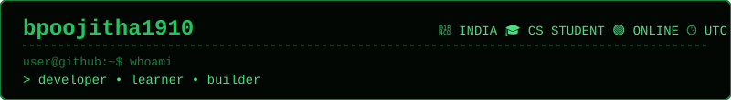
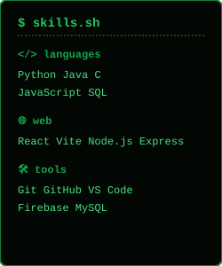
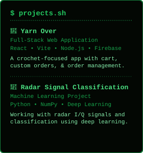
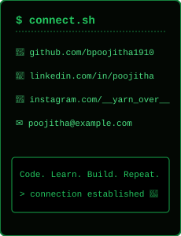

<!-- Header Card -->

  

<!-- Contribution Snake Dynamic Graph (Green Matrix Style) -->

  

<!-- Main Middle Section Grid -->
<table border="0" cellspacing="0" cellpadding="0" width="100%">
  <tr>
    <!-- Left Column: Profile Picture & Short Bio -->
    <td width="50%" valign="top" style="background-color: #030703; border: 2px solid #15803d; border-radius: 8px; padding: 15px;">
      
● ● ● user@github:~$ cat ./profile

      

        
      

       
      <h3 style="color: #22c55e; font-family: monospace; margin: 5px 0;">Poojitha</h3>
      

        Computer Science Student 
        Developer 
        Problem Solver
      

      

      
<b>focus_on:</b>

      

        &gt; Web Development 
        &gt; Machine Learning 
        &gt; Deep Learning 
        &gt; Building Cool Things
      

    </td>

    <td width="2%"></td>

    <!-- Right Column: Whoami Terminal Block -->
    <td width="48%" valign="top" style="background-color: #030703; border: 2px solid #15803d; border-radius: 8px; padding: 15px;">
      
● ● ● user@github:~$ whoami

      <pre style="color: #4ade80; background: transparent; border: none; font-family: monospace; font-size: 12px;">
$ whoami
&gt; Poojitha

$ role
&gt; Computer Science Student

$ location
&gt; India

$ currently_learning
&gt; Machine Learning
&gt; Deep Learning
&gt; Web Development

$ code_status
&gt; Building cool things
&gt; Debugging cool things

[██████████████████░░] 90%
      </pre>
    </td>
  </tr>
</table>

 

<!-- Bottom Section: Skills, Projects, Connect Cards -->
<table border="0" cellspacing="0" cellpadding="0" width="100%">
  <tr>
    <td width="32%" valign="top">
      
    </td>
    <td width="2%"></td>
    <td width="36%" valign="top">
      
    </td>
    <td width="2%"></td>
    <td width="28%" valign="top">
      
    </td>
  </tr>
</table>

 

<!-- Footer Card -->

